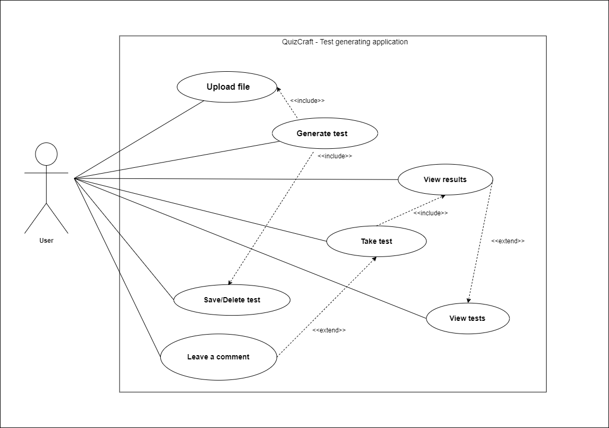

# QuizCraft

### Team Members
- Augustas Budnikas
- Ignė Balvočiūtė
- Emilija Marija Dailydžionytė

### Technologies Used

**Front-end:**
- React

**Back-end:**
- .NET 8
- C#
- Entity Framework Core
- PostgreSQL
- OpenAI API
- Docker

### Deployment on a Local Machine
Checkout the Github Repository, then run the following commands
Using .NET 8 SDK:
```
cd QuizCraft.Domain.API
dotnet run
```

or using Docker
```
cd QuizCraft.Domain.API
docker build -t quicraft:latest .
docker run -p 8080:8080 quizcraft:latest
```

### Project Structure

**Main components**
 - `User`
 - `Question`

**Data flow**

The project utilizes the following key components and database tables:

1. Users Table: 
   - _Stores user information, such as account details and preferences._
   - _Each new user is registered here._

2. Files Table: 
   - _Stores data about the files uploaded by users._

3. Generated Questions Table: 
   - _Stores the questions generated by the AI for each uploaded file._
   - _Allows users to retake tests if necessary._

4. Test Results Table: 
   - _Stores a history of user test results and scores._
   - _Enables users to review past performance._

**File Upload and Test Generation**

1. File Upload: 
   - _Users upload learning materials through the file upload interface._

2. Processing: 
   - _The backend processes the file and extracts the content._

3. Test Generation: 
   - _AI engine analyzes the content and generates relevant questions._

4. Test Output: 
   - _The generated test is displayed to the user, allowing them to answer questions and submit responses._

### Use-case Diagram

